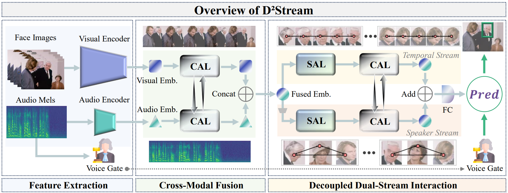

# D$^{2}$Stream: Decoupled Dual-Stream Temporal-Speaker Interaction for Audio-Visual Speaker Detection

> 投稿至 ICASSP 2026 🚀😊

Audio-visual speaker detection aims to identify the active speaker in videos by leveraging complementary audio and visual cues. Existing methods often suffer from computational inefficiency or suboptimal performance due to joint modeling of temporal and speaker interactions. We propose D²Stream, a decoupled dual-stream framework that separates cross-frame temporal modeling from within-frame speaker discrimination. Audio and visual features are first aligned via cross-modal attention, then fed into two lightweight streams: a Temporal Interaction Stream captures long-range temporal dependencies, while a Speaker Interaction Stream models per-frame inter-person relationships. The temporal and relational features extracted by the two streams interact via cross-attention to enrich representations. A lightweight Voice Gate module further mitigates false positives from non-speech facial movements. On AVA-ActiveSpeaker, D²Stream achieves a new state-of-the-art at 95.6% mAP, with 80% reduction in computation compared to GNN-based models and 30% fewer parameters than attention-based alternatives, while also generalizing well on Columbia ASD. 



---

## 🛠 How to Use

### 1. Environment Set Up

Install all required dependencies:

```
pip install -r requirements.txt
```

> It’s recommended to use a virtual environment (e.g., `venv` or `conda`) to avoid dependency conflicts.

### 2. Download Datasets

AVA dataset 下载可以 be found in [here](https://github.com/TaoRuijie/TalkNet_ASD/blob/main/utils/tools.py#L34). After downloading, place the dataset in the **parent directory** of this project and rename the folder to:

```shell
data
```

### 3. Run Train

Run the following command to train the model:

```shell
python train.py
```

### 4. Run Eval

Run the following command to evaluate the trained model:

```shell
python eval.py
```

---

### 💓Acknowledge

This project builds upon the excellent work from:

- [TalkNet](https://github.com/TaoRuijie/TalkNet-ASD)
- [LoCoNet](https://github.com/SJTUwxz/LoCoNet_ASD)
- [TalkNce](https://github.com/kaistmm/TalkNCE)

We sincerely thank the authors of these projects for their clean and well-structured code, which greatly facilitated this implementation. 😘

